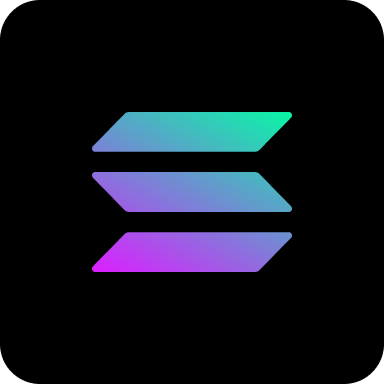
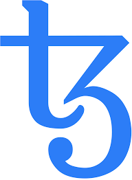

### Smart contract & DEFI specialist and full-stack engineer

- Smart contract development
- Chain (Ethereum, Flow, Binance, Polygon, Casper, Avalanche, Solana, Tezos ...)
- Solidty & Cadence & Rust
- Wallets & Clients (Ganache, Metamask, Exodus, Mist, Parity, Geth, MEW)
- dApp (Ethers, Web3, infura, Hardhat, MIST/Remix)
- FT & NFT Token and coin development
- LGE, ICO, IDO, Presale, Dex, ERC-(20, 721, 1155, 223) & Audit
- React / Vue / Angular / TypeScript
- Bootstrap / Tailwind
- GraphQL / Restful API
- Laravel / Django / Node.js / Ruby on Rails
- SQL / NoSQL

**Languages and Tools:**

<code></code>
<code></code>
<code></code>
<code></code>
<code></code>
<code></code>
<code>...</code>
<code></code>
<code></code>
<code></code>
<code></code>
<code></code>
